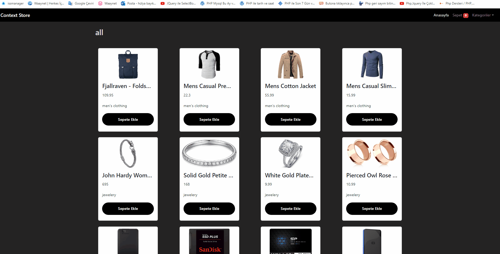

<h2> React + Vite</h2>

Bu proje, React kullanılarak oluşturulan bir e-ticaret sitesini içerir. Bu site, kullanıcıların ürünleri kategoriye göre listelemesine,
sepete ürün eklemesine, sepetten ürün çıkarmasına ve ürün miktarını azaltmasına olanak tanır. Ayrıca, bu işlemler gerçekleşirken kullanıcıya
uygun uyarılar gösterilir.

<h2>Kullanılan Araçlar</h2>

- React :Kullanıcı arayüzü oluşturulmuştur.

- Vite : Modern Js proje geliştirme deneyimi iyileştirmek için Vite aracı kullanılmıştır.

- Context API:Bileşenler arasında veri paylaşımını kolaylaştırmak için kullanılmıştır.(Urun verilerini ve sepet durumunu yönetmek için)

- React-router-dom :React projelerinde yönlendirme işlevselliğini sağlayan bir pakettir. Çoklu sayfalar veya SPA'lar (Tek Sayfa Uygulamaları) oluştururken kullanılır.
  react-router-dom, tarayıcı URL'sini dinler ve kullanıcıyı uygun bileşene yönlendirir.

  - useState ve useEffect Hooks: Bileşen durumlarını yönetmek ve etkileşimleri işlemek için.

  - useLocalStorage Hook: Sepet durumunu yerel depolamada saklamak için kullanılmıştır

<h2>Kullanımı</h2>

- Projeyi klonlayın

git clone https://github.com/kullanici/e-ticaret.git

- Proje Dizinine Gidin

cd klasorunuz

- Gerekli Bagımlılıkları yukleyin

npm install

-Tarayıcıda açmak için

npm run dev

<h2>Ekran Görüntüsü</h2>

